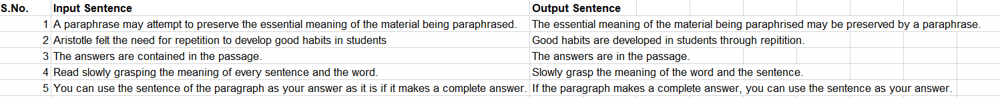
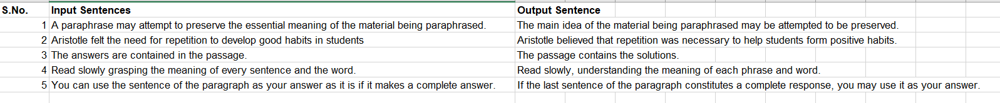
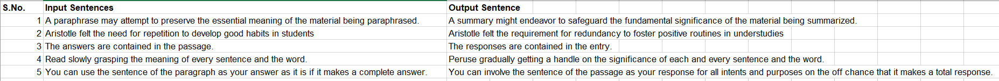

# rephraser

This toolkit is created from scratch using Pegasus Model (PEGASUS: Pre-training with Extracted Gap-sentences for Abstractive Summarization)

### About
The program takes advantage of the GPU, that's it is preferred to run it on Google Colab as it provides a powerful GPU which is indeed needed for intensive tensorflow programs.


## Deployment

To run this project you can either download the zip file or clone it using git cli.

For cloning using git cli:
```bash
    gh repo clone tanishque02/rephraser
```
OR just open the notebook in Google Colab directly


## Results

Model Result:


Quillbot Result:


Snipbot Result:

